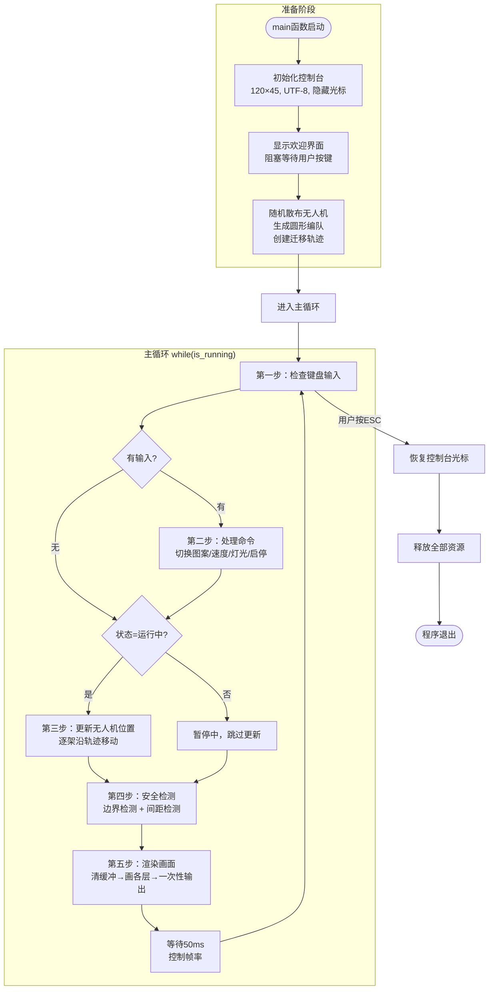
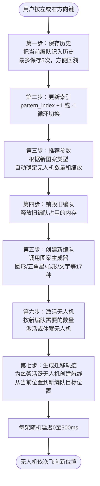
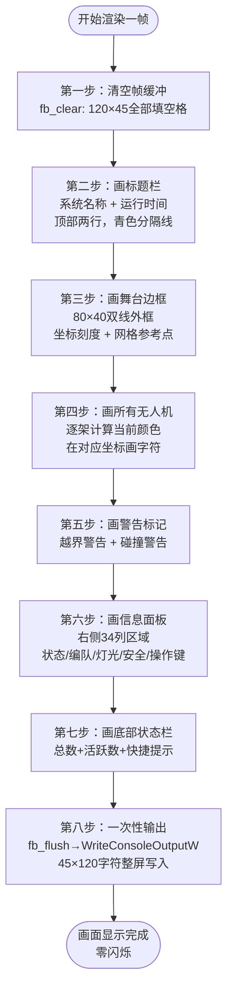

# 无人机编队灯光秀模拟系统 — 需求分析报告

> **选题编号**: 18  
> **课程**: C语言课程设计  
> **院校**: 华中科技大学 · 机械科学与工程学院 · 测控专业 2025级  
> **指导老师**: 周凯波  
> **总代码量**: ~4400行 (C/C++)  
> **编译环境**: GCC / MinGW-w64  
> **依赖**: 无第三方库，仅 Windows Console API  

---

## 一、前言

### 1. 编写背景

无人机编队灯光秀是近年来广受关注的表演形式，通过上百架无人机在空中排列成各种图案并同步变换灯光颜色，呈现出震撼的视觉效果。本课题要求设计一个在 Windows 控制台下运行的无人机编队灯光秀模拟系统，用字符画的方式在终端中实时展示无人机编队的飞行和灯光变化。

根据课程设计任务书（选题18），系统需支持 500 架无人机的编队控制、17 种几何图案切换、8 种灯光颜色、5 种灯光特效，以及安全检测、轨迹存储回放等功能。系统使用 C/C++ 语言开发，基于 Windows Console API 实现字符画渲染，不依赖任何第三方图形库。

### 2. 编写目的

本报告对"无人机编队灯光秀模拟系统"进行了全面的需求分析和系统设计。通过本报告，读者可以了解：

- 系统的功能需求和非功能需求
- 系统的模块划分和架构设计
- 各模块的核心算法和数据结构
- 程序的运行流程和控制逻辑
- 所有函数的接口说明

本报告的预期受众为课程指导教师、软件开发和测试人员。

### 3. 参考资料

1. 王士元. C高级实用程序设计. 北京: 清华大学出版社. 1996年
2. 周纯杰，何顶新等. 程序设计与应用（C/C++编程）. 北京: 机械工业出版社. 2008年
3. [美] Prata. C Primer Plus（第六版）. 北京：人民邮电出版社. 2016年
4. 严蔚敏，吴伟民编著. 数据结构（C语言版）. 北京：清华大学出版社. 2018年
5. Microsoft Docs. Windows Console API Reference.
6. 课程设计任务书（选题18）：无人机编队灯光秀模拟系统设计

### 4. 编者的话

本系统选题为无人机编队灯光秀模拟，这是 20 个可选课题中最具视觉表现力的题目之一。在实现过程中，我们面临的主要挑战包括：如何在纯控制台环境下实现流畅的 20fps 动画、如何设计 17 种不同几何图案的生成算法、如何在 500 架无人机之间进行高效的碰撞检测等。通过本项目，我们深入理解了模块化设计、帧缓冲渲染、轨迹插值等核心编程概念。

---

## 二、任务概述

### 1. 目标功能

根据课程设计任务书（选题18），系统需实现以下功能：

| 编号 | 功能模块 | 需求描述 | 状态 |
|------|---------|---------|------|
| F1 | 编队初始化 | 设置无人机数量、初始位置和飞行高度 | 已完成 |
| F2 | 轨迹设计 | 输入关键坐标点，无人机按直线自动移动，完成队形变换 | 已完成 |
| F3 | 灯光控制 | 控制灯光开关、颜色切换（8种）和闪烁效果 | 已完成 |
| F4 | 实时模拟 | 在终端动态显示无人机位置和灯光状态 | 已完成 |
| F5 | 安全检测 | 判断越界和间距过近，给出提示 | 已完成 |
| F6 | 数据回放 | 保存/读取轨迹数据，重新演示灯光秀 | 已完成 |

超出任务书要求的扩展功能：

| 编号 | 功能 | 描述 |
|------|------|------|
| E1 | 15种几何图案 | 圆形/方形/三角/菱形/五角星/五边形/六边形/心形/螺旋/直线/箭头/十字/弧形/网格/随机 |
| E2 | 文字编队 | 英文/数字5×7点阵，支持A-Z、0-9 |
| E3 | 图片编队 | 加载BMP位图，暗像素位置放置无人机 |
| E4 | 灯光特效 | 波浪灯、交替闪烁、流水灯、颜色渐变 |
| E5 | 编队历史 | 最近5次编队一键回溯 |
| E6 | 动态速度 | 实时调节模拟速度 |
| E7 | 碰撞避让 | 自动推开过近的无人机 |

### 2. 编写规范

**命名规范**:
- 文件名使用小写字母和下划线（如 `drone.cpp`、`file_io.cpp`）
- 结构体使用大驼峰命名（如 `Drone`、`Formation`、`SafetyZone`）
- 函数使用小写+下划线命名（如 `drone_create`、`traj_update_fleet`）
- 常量使用大写+下划线命名（如 `MAX_DRONE_COUNT`、`CONSOLE_WIDTH`）
- 枚举类型使用大驼峰，枚举值使用大写+下划线（如 `LightColor`、`COLOR_RED`）

**注释规范**:
- 每个头文件顶部注明模块职责
- 每个函数原型后注明功能、参数和返回值
- 复杂算法和流程给出相应的注释

**设计原则**:
- 无全局变量，所有状态封装在结构体中，通过指针传递
- 头文件/源文件分离，模块间低耦合
- 每个模块有明确的职责边界

---

## 三、运行环境和配置

### 1. 硬件接口

- 处理器：Intel Pentium 或以上
- 硬盘：空间 100MB 以上
- 屏幕适配器：支持 Windows Console API
- 系统运行内存：要求 64MB 以上

### 2. 软件接口

- 开发软件工具：GCC / MinGW-w64
- 文字编辑工具：Visual Studio Code
- 操作系统：Windows 10 / Windows 11
- 依赖：无第三方库，仅使用 Windows Console API（`kernel32.dll`）

项目文件结构：

```
Drone/
├── main.cpp               # 程序入口（61行）
├── commands.txt            # 课程设计任务书
├── include/
│   ├── common.h            # 公共类型、常量、控制台颜色定义（270行）
│   ├── drone.h             # 无人机实体模块接口
│   ├── light.h             # 灯光控制模块接口
│   ├── formation.h         # 编队与图案生成模块接口
│   ├── trajectory.h        # 轨迹与插值模块接口
│   ├── safety.h            # 安全检测模块接口
│   ├── graphics.h          # 控制台渲染模块接口
│   ├── ui.h                # 用户输入模块接口
│   ├── file_io.h           # 文件读写模块接口
│   └── controller.h        # 主控制器模块接口
└── src/
    ├── drone.cpp            # 无人机生命周期与状态操作（236行）
    ├── light.cpp            # 编队级灯光效果（138行）
    ├── formation.cpp        # 15种图案生成 + 5×7点阵文字（914行）
    ├── trajectory.cpp       # 航点管理与逐帧线性插值（214行）
    ├── safety.cpp           # 边界/间距检测 + 碰撞避让（180行）
    ├── graphics.cpp         # CHAR_INFO帧缓冲 + WriteConsoleOutputW（879行）
    ├── ui.cpp               # 键盘输入处理（150行）
    ├── file_io.cpp          # 轨迹数据持久化（105行）
    └── controller.cpp       # 主循环与模块调度（648行）
```

编译命令：

```bash
g++ -std=c++11 -Wall -o drone_show.exe \
    main.cpp \
    src/drone.cpp src/light.cpp src/formation.cpp \
    src/trajectory.cpp src/safety.cpp \
    src/graphics.cpp src/ui.cpp src/file_io.cpp \
    src/controller.cpp \
    -I include
```

### 3. 控制

该系统通过键盘直接进行控制。程序在每帧（50ms间隔）使用 `_kbhit()` 检测是否有按键按下，若有则通过 `_getch()` 读取键值。普通按键直接映射为操作码，扩展键（如方向键）通过两字节读取（0xE0 + 键码）识别。

按键映射表：

| 按键 | 操作码 | 功能 |
|------|--------|------|
| `S` / `Enter` | `UI_CMD_START` | 开始模拟 |
| `P` / `Space` | `UI_CMD_PAUSE` | 暂停/继续 |
| `Q` | `UI_CMD_STOP` | 停止模拟 |
| `←` / `→` | `UI_CMD_PREV/NEXT_PATTERN` | 切换图案 |
| `↑` / `↓` | `UI_CMD_SPEED_UP/DOWN` | 调节速度 |
| `E` | `UI_CMD_LIGHT_FX` | 切换灯光特效 |
| `C` | `UI_CMD_CHANGE_COLOR` | 切换颜色 |
| `B` | `UI_CMD_TOGGLE_BLINK` | 闪烁开关 |
| `T` | `UI_CMD_TEXT_INPUT` | 输入文字编队 |
| `H` | `UI_CMD_HISTORY` | 历史回溯 |
| `ESC` | `UI_CMD_EXIT` | 退出 |

---

## 四、需求分析与系统设计

### 1. 需求分析

根据课程设计要求和用户操作场景，系统核心需求归纳如下：

- **编队模拟**：用户需要看到 500 架无人机在表演区内按不同图案排列并动态切换
- **灯光效果**：无人机需支持 8 种颜色切换和波浪、闪烁等动态特效
- **实时交互**：用户通过键盘实时切换图案、调节速度、改变灯光
- **安全保障**：自动检测无人机越界和相互碰撞，给出警告
- **数据持久化**：支持保存当前轨迹到文件，后续可读取回放

系统有 4 种运行状态：空闲（IDLE）、运行中（RUNNING）、已暂停（PAUSED）、回放中（REPLAY）。状态切换如下：

```
            START
IDLE ────────────────→ RUNNING
  ↑                      │
  │ STOP            PAUSE│
  │                 ═════╝
  │                      │
  └──────────────────────┘
      (PAUSED时按P恢复)
```

### 2. 系统设计

#### 基本框架

系统采用模块化架构，顶层由 Controller（主控制器）统一调度各功能模块：

```
                        ┌─────────────┐
                        │   main.cpp  │
                        └──────┬──────┘
                               │
                    ┌──────────▼──────────┐
                    │   controller.h/cpp  │  ← 顶层调度器
                    └──────────┬──────────┘
                               │
        ┌──────────┬───────────┼───────────┬──────────┬──────────┐
        │          │           │           │          │          │
   ┌────▼───┐ ┌───▼────┐ ┌───▼────┐ ┌───▼────┐ ┌───▼───┐ ┌───▼───┐
   │ drone  │ │ light  │ │traject │ │ safety │ │graphics│ │  ui   │
   │.h/.cpp │ │.h/.cpp │ │.h/.cpp │ │.h/.cpp │ │.h/.cpp│ │.h/.cpp│
   └────┬───┘ └───┬────┘ └───┬────┘ └───┬────┘ └───┬───┘ └───┬───┘
        │         │          │          │          │         │
        └─────────┴──────────┴──────────┴──────────┴─────────┘
                               │
                    ┌──────────▼──────────┐
                    │   common.h          │  ← 所有模块共享
                    └─────────────────────┘
```

Controller 结构体作为核心状态容器，持有所有模块的数据：

```c
typedef struct {
    Drone*      fleet[300];           // 无人机编队
    int         drone_count;          // 实际数量
    Formation*  current_formation;    // 当前编队
    Trajectory* trajectories[300];   // 轨迹数组
    SafetyZone* safety_zone;         // 安全区域
    SafetyResult safety_result;      // 检测结果
    SimState    sim_state;           // 模拟状态
    float       sim_speed;           // 速度倍率
    LightColor  selected_color;      // 当前颜色
    LightMode   selected_light_mode; // 灯光模式
    FormationHistory history[5];     // 编队历史
    int         history_count;       // 历史数量
    int         light_fx;            // 灯光特效编号
    int         pattern_index;       // 图案索引
    int         elapsed_ms;          // 运行时间
} Controller;
```

#### 公共模块 (common.h)

为所有模块提供统一的数据类型、枚举和常量定义。

核心常量：

| 常量 | 值 | 说明 |
|------|---|------|
| `CONSOLE_WIDTH` | 120 | 控制台总列数 |
| `CONSOLE_HEIGHT` | 45 | 控制台总行数 |
| `STAGE_COLS` | 80 | 表演区宽度 |
| `STAGE_ROWS` | 40 | 表演区高度 |
| `STAGE_LEFT` | 2 | 表演区左边距 |
| `STAGE_TOP` | 2 | 表演区上边距 |
| `PANEL_LEFT` | 84 | 面板起始列 |
| `PANEL_WIDTH` | 34 | 面板宽度 |
| `MAX_DRONE_COUNT` | 300 | 最大无人机数量 |
| `MAX_WAYPOINTS` | 200 | 最大航点数 |
| `FRAME_INTERVAL_MS` | 50 | 帧间隔（20fps） |
| `SAFETY_MIN_DISTANCE` | 3 | 安全间距（字符格） |

核心枚举：
- `LightColor` (9种): OFF / RED / GREEN / BLUE / WHITE / YELLOW / CYAN / PURPLE / ORANGE
- `LightMode` (3种): STEADY / BLINK / OFF
- `PatternType` (17种): NONE / CIRCLE / SQUARE / TRIANGLE / DIAMOND / STAR / PENTAGON / HEXAGON / HEART / SPIRAL / LINE / ARROW / CROSS / ARC / GRID / RANDOM / TEXT
- `SimState` (4种): IDLE / RUNNING / PAUSED / REPLAY

核心数据结构：

```c
// 二维坐标
typedef struct { float x; float y; } Point2f;   // 浮点（计算用）
typedef struct { int   x; int   y; } Point2i;    // 整数（渲染用）

// 灯光状态
typedef struct {
    LightColor  color;
    LightMode   mode;
    int         blink_interval_ms;
    int         blink_timer_ms;
    int         is_visible;
} LightState;

// 无人机
typedef struct {
    int         id;             // 唯一标识
    Point2f     position;       // 当前坐标
    float       height;         // 飞行高度
    LightState  light;          // 灯光状态
    int         is_active;      // 是否活跃
} Drone;

// 航点
typedef struct {
    Point2f     position;
    LightColor  color;
    LightMode   mode;
    int         hold_ms;
} WayPoint;

// 轨迹
typedef struct {
    WayPoint    waypoints[MAX_WAYPOINTS];
    int         waypoint_count;
    int         current_index;
    float       total_progress;
} Trajectory;

// 编队
typedef struct {
    int         formation_id;
    char        name[32];
    PatternType pattern;
    Point2f     center;
    float       scale;
    float       rotation_deg;
    Point2f     targets[MAX_DRONE_COUNT];
    int         drone_count;
    char        display_text[32];
} Formation;

// 安全区域与检测结果
typedef struct {
    int         x_min, y_min, x_max, y_max;
    int         min_distance;
} SafetyZone;

typedef struct {
    int         boundary_ids[MAX_DRONE_COUNT];
    int         pair_a[MAX_DRONE_COUNT * 2];
    int         pair_b[MAX_DRONE_COUNT * 2];
    int         boundary_violations;
    int         distance_violations;
} SafetyResult;
```

#### 无人机实体模块 (drone.h/cpp)

**职责**: 单架无人机的生命周期管理和状态操作。

**数据流**:
```
drone_create(id, x, y, height)
    ├─ malloc(Drone) → 堆分配
    ├─ 初始化 id, position, height, is_active=1
    └─ 初始化 light: COLOR_WHITE, LIGHT_STEADY

drone_get_current_color(drone, delta_ms)
    ├─ LIGHT_OFF → CON_BLACK
    ├─ LIGHT_STEADY → color_table[light.color]
    └─ LIGHT_BLINK → 累加 blink_timer, 切换 is_visible
```

核心函数：

| 函数 | 功能 |
|------|------|
| `drone_create` | 在堆上创建无人机，初始化所有字段 |
| `drone_destroy` | 释放单架无人机内存 |
| `drone_create_fleet` | 批量创建 count 架无人机 |
| `drone_set_position` | 瞬移到指定坐标（用于初始化） |
| `drone_move` | 增量移动（每帧调用） |
| `drone_get_current_color` | 根据灯光状态计算当前显示颜色 |
| `drone_set_light_color` | 设置灯光颜色 |
| `drone_set_light_mode` | 设置灯光模式（常亮/闪烁/关闭） |

#### 灯光控制模块 (light.h/cpp)

**职责**: 编队级的灯光效果控制，提供 5 种动态特效。

灯光效果：

| 效果 | 函数 | 算法 |
|------|------|------|
| 全队统一 | `light_fleet_set_color/mode` | 遍历编队，逐架设置 |
| 波浪灯 | `light_wave_effect` | 按索引延迟：`lit_count = elapsed_ms / delay_ms`，前N架亮灯 |
| 交替闪烁 | `light_alternate` | 奇数偶数组相位翻转：phase 0→1 每 interval_ms |
| 流水灯 | `light_flow` | 滑动窗口：`[offset, offset+window_size)` 区间无人机亮灯 |
| 颜色渐变 | `light_color_lerp` | 阈值切换：t<0.5→color_from, t≥0.5→color_to |

颜色映射表（drone.cpp 内部）:
- `COLOR_RED` → `CON_RED` (FOREGROUND_RED | FOREGROUND_INTENSITY)
- `COLOR_GREEN` → `CON_GREEN` (FOREGROUND_GREEN | FOREGROUND_INTENSITY)
- `COLOR_BLUE` → `CON_BLUE` (FOREGROUND_BLUE | FOREGROUND_INTENSITY)
- `COLOR_WHITE` → `CON_WHITE` (R|G|B|INTENSITY)
- `COLOR_YELLOW` → `CON_YELLOW` (R|G|INTENSITY)

#### 编队与图案生成模块 (formation.h/cpp)

**职责**: 使用策略模式实现 17 种图案的生成器架构。每种图案由独立的生成器函数实现，通过 `pattern_generate()` 统一调度。

```
            pattern_generate(type, center, scale, rotation, count, out, text)
                                  │
                ┌─────────────────┼─────────────────────┐
                │                 │                     │
        ┌───────▼──────┐  ┌──────▼──────┐      ┌──────▼──────┐
        │ gen_circle   │  │ gen_square  │ ...  │ gen_text    │
        │ 等角圆周分布  │  │ 等距边框分布 │      │ 5×7点阵字库 │
        └──────────────┘  └─────────────┘      └─────────────┘
```

17种图案生成算法：

| 图案 | 算法 | 关键参数 |
|------|------|---------|
| 圆形 | `angle = 360°/count * i`，等距分布圆周 | radius (scale) |
| 正方形 | `步长 = 周长/count`，沿四条边分布 | side (scale) |
| 正三角形 | 三条边等分，顶点位于重心上方 | size (边长) |
| 菱形 | 四条边等分，对角轴水平/垂直 | size (对角长) |
| 五角星 | 10条边等分：外圈R + 内圈r=0.382R交替 | R (外圈半径) |
| 正五/六边形 | N条边等分，等角顶点 | size (外接圆半径) |
| 心形 | 参数方程：x=16sin³t, y=13cost-5cos2t-2cos3t-cos4t | scale/16 |
| 螺旋 | 阿基米德螺旋：r = b*θ, θ∈[0, 3*2π] | size/最大角度 |
| 直线 | 等间距水平排列 | length |
| 箭头 | 箭身(70%) + 三角形箭头(30%) | size |
| 十字 | 竖直臂(50%) + 水平臂(50%) | size (臂长) |
| 弧形 | 等角圆弧，起始-150°扫300° | radius |
| 网格 | ceil(sqrt(N))列，等间距 | size/(cols+1) |
| 随机 | 均匀随机坐标 | size (散布范围) |
| 文字 | 5×7点阵字库（ASCII 32-90） | char_size |
| 图片 | BMP像素采样，暗像素放无人机 | 缩放网格 |

**扩展新图案**: 只需添加一个生成器函数 + 在 `pattern_generate()` 的 switch 中注册。

#### 轨迹与插值模块 (trajectory.h/cpp)

**职责**: 关键航点管理与逐帧线性插值。

每帧执行的核心算法：
```
1. 计算到目标航点的距离: dist = sqrt(dx² + dy²)
2. 移动步长: step = speed * delta_ms / 1000.0
3. 如果 dist < 0.5: 到达航点 → 同步灯光 → 切到下一航点
4. 否则: 沿方向向量移动一步（不超过目标）
   drone.x += (dx/dist) * step
   drone.y += (dy/dist) * step
```

批量操作：
- `traj_from_formation()`: 为编队中每架无人机创建"当前位置→编队目标"的航点
- `traj_update_fleet()`: 逐帧批量更新所有无人机的轨迹

#### 安全检测模块 (safety.h/cpp)

**职责**: 每帧自动执行边界检测和间距检测。

边界检测 (O(n)):
```
遍历所有活跃无人机:
    if (x < zone.x_min || x > zone.x_max || y < zone.y_min || y > zone.y_max):
        记录越界 → boundary_violations++
```

间距检测 (O(n²)):
```
两两遍历 (i from 0..n, j from i+1..n):
    dist = DISTANCE(fleet[i], fleet[j])
    if (dist < zone.min_distance):
        记录违规对 → distance_violations++
```

碰撞避让 (O(n²)):
```
两两遍历:
    if (dist < min_distance/2 && dist > 0.001):
        force = (avoid_dist - dist) / avoid_dist * strength
        排斥力推开两架无人机
```

#### 图形渲染模块 (graphics.h/cpp)

**职责**: 控制台字符画渲染，使用帧缓冲消除闪烁。

帧缓冲方案:
```
  ┌─────────────────────────────────────┐
  │  CHAR_INFO g_fb[45][120]            │  ← 内存中的虚拟屏幕
  │  - fb_clear()    : 全部填空格       │
  │  - fb_put_wchar(): 写单个WCHAR      │
  │  - fb_puts()     : 写UTF-8字符串    │
  │  - fb_printf()   : 格式化写字符串   │
  │  - fb_flush()    : 一次性写入控制台 │
  └─────────────────────────────────────┘
         │  WriteConsoleOutputW(hOut, g_fb, ...)
         ▼
  ┌─────────────────────────────────────┐
  │  控制台缓冲区 (120×45)              │
  │  用户可见                           │
  └─────────────────────────────────────┘
```

坐标映射：
- 舞台逻辑坐标: `(stage_x, stage_y)` ∈ `[0, 79] × [0, 39]`
- 控制台屏幕坐标: `(STAGE_LEFT + stage_x, STAGE_TOP + stage_y)`
- 无人机显示: `(int)(drone.position.x + 0.5)` 四舍五入

双缓冲机制：`fb_clear()` → 全部绘制 → `fb_flush()`，帧缓冲内部完成所有修改，最后一次性输出，零闪烁。

#### 用户输入模块 (ui.h/cpp)

**职责**: 键盘输入检测与操作码映射。使用非阻塞 `_kbhit()` + `_getch()`，扩展键两字节（0xE0 + 键码）。

#### 文件读写模块 (file_io.h/cpp)

**职责**: 轨迹数据持久化。

文件格式（二进制）:
```
Header (16B):
  magic    : 4B ("DRON" = 0x44524F4E)
  count    : 4B (无人机数量)
  frames   : 4B (总帧数)
  interval : 4B (帧间隔ms)

Frame 0, 1, ... N:
  drone[i].x     : 4B (float)
  drone[i].y     : 4B (float)
  drone[i].color : 1B (LightColor enum)
  ... (共 count 架)
```

### 3. 程序框图与流程设计

#### 主循环流程图



主循环每 50ms 执行一轮，画面每秒刷新 20 次。其中安全检测包含边界检测（O(n)）和间距检测（O(n²)），500 架无人机两两配对共约 4.5 万对。

#### 图案切换流程



#### 渲染帧流程



---

## 五、界面设计

### 1. 控制方式

本系统使用纯键盘控制（无鼠标支持）。程序启动后首先显示欢迎界面，列出所有操作键位。用户按任意键进入主界面后，通过键盘快捷键控制模拟过程。

### 2. 界面设计

屏幕布局（120列 × 45行控制台）:

```
┌──────────────────────────────────────────────────────────────────┐
│  无人机编队灯光秀模拟系统                          00:00 [待命]  │ ← 标题栏
├──────────────────────────────────────────────────────────────────┤
│ ┌──────────────────────────────┐ ┌────────────────────────────┐ │
│ │         表演区域              │ │     无人机灯光秀模拟       │ │
│ │                              │ ├────────────────────────────┤ │
│ │       ·  ·  ·  ·  ·         │ │ 状态 ○ 待命中...           │ │
│ │                              │ │ 时间 00:00                 │ │
│ │    ·     ●●●      ·         │ │ 数量 30 架                 │ │
│ │         ●●○○●               │ │ 速度 1.00x                 │ │
│ │    ·     ●●●      ·         │ ├────────────────────────────┤ │
│ │                              │ │ 当前编队                   │ │
│ │       ·  ·  ·  ·  ·         │ │ 圆形编队                   │ │
│ │                              │ │ 图案 圆形                  │ │
│ └──────────────────────────────┘ ├────────────────────────────┤ │
│                                  │ 灯光设置                   │ │
│                                  │ 颜色 ● 白色                │ │
│                                  │ 模式 常亮                  │ │
│                                  ├────────────────────────────┤ │
│                                  │ 安全状态                   │ │
│                                  │ 全部正常                   │ │
│                                  ├────────────────────────────┤ │
│                                  │ 操作键                     │ │
│                                  │ S    开始  P  暂停         │ │
│                                  │ Q    停止  ESC 退出        │ │
│                                  │ ←→   图案  ↑↓  调速        │ │
│                                  │ E    特效  C  换色         │ │
│                                  │ B    闪烁  T  文字         │ │
│                                  │ H    历史                   │ │
│                                  └────────────────────────────┘ │
├──────────────────────────────────────────────────────────────────┤
│ 总:300  活跃:30              按 H 查看历史 | 按 T 输入文字        │ ← 状态栏
└──────────────────────────────────────────────────────────────────┘
```

界面分为四大区域：
- **标题栏**（Row 0-1）：系统名称 + 运行时间 + 状态指示
- **表演区**（Row 2-41，列 2-81）：80×40 舞台，显示无人机位置和编队图案
- **信息面板**（Row 2-41，列 84-117）：右侧 34 列，显示状态/编队/灯光/安全/操作键
- **状态栏**（Row 44）：显示总无人机数、活跃数和快捷操作提示

---

## 六、函数说明及函数原型

### 无人机模块

```c
// 生命周期
Drone*  drone_create(int id, float x, float y, float height);
void    drone_destroy(Drone* drone);
Drone** drone_create_fleet(int count, int start_id);
void    drone_destroy_fleet(Drone** fleet, int count);

// 位置操作
void drone_set_position(Drone* drone, float x, float y, float height);
void drone_move(Drone* drone, float dx, float dy, float dh);
void drone_get_display_pos(const Drone* drone, int* x, int* y);

// 灯光操作
void drone_set_light_color(Drone* drone, LightColor color);
void drone_set_light_mode(Drone* drone, LightMode mode);
void drone_set_blink_interval(Drone* drone, int interval_ms);
void drone_light_onoff(Drone* drone, int on);

// 状态查询
int drone_is_active(const Drone* drone);
ConsoleColor drone_get_current_color(Drone* drone, int delta_ms);
```

### 编队模块

```c
// 生成器调度
int pattern_generate(PatternType type, Point2f center,
                     float scale, float rotation_deg,
                     int drone_count, Point2f out_positions[],
                     const char* text);

// 编队管理
Formation* formation_create(const char* name, PatternType type,
                            Point2f center, float scale, float rotation,
                            int drone_count, const char* display_text);
void       formation_destroy(Formation* formation);
void       formation_update(Formation* f, PatternType type,
                            Point2f center, float scale, float rotation);
int        formation_get_target(const Formation* f, int index,
                                float* x, float* y);

// 单个生成器（17种）
int gen_circle(Point2f center, float radius, int count, Point2f out[]);
int gen_square(Point2f center, float side, int count, Point2f out[]);
int gen_triangle(Point2f center, float size, int count, Point2f out[]);
int gen_diamond(Point2f center, float size, int count, Point2f out[]);
int gen_star(Point2f center, float size, int count, Point2f out[]);
int gen_pentagon(Point2f center, float size, int count, Point2f out[]);
int gen_hexagon(Point2f center, float size, int count, Point2f out[]);
int gen_heart(Point2f center, float size, int count, Point2f out[]);
int gen_spiral(Point2f center, float size, int count, Point2f out[]);
int gen_line(Point2f center, float length, int count, Point2f out[]);
int gen_arrow(Point2f center, float size, int count, Point2f out[]);
int gen_cross(Point2f center, float size, int count, Point2f out[]);
int gen_arc(Point2f center, float radius, int count, Point2f out[]);
int gen_grid(Point2f center, float size, int count, Point2f out[]);
int gen_random(Point2f center, float size, int count, Point2f out[]);
int gen_text(Point2f center, float char_size, const char* text,
             int count, Point2f out[]);

// 工具
void pattern_recommend(PatternType type, int text_len,
                       int* out_count, float* out_scale);
void rotate_point(float cx, float cy, float x, float y,
                  float deg, float* out_x, float* out_y);
```

### 轨迹模块

```c
// 生命周期
Trajectory* traj_create(void);
void        traj_destroy(Trajectory* traj);
int         traj_add_waypoint(Trajectory* traj, Point2f pos,
                              LightColor color, LightMode mode, int hold_ms);
void        traj_clear(Trajectory* traj);

// 逐帧更新
int  traj_update(Trajectory* traj, Drone* drone, float speed, int delta_ms);
void traj_jump_to(Trajectory* traj, Drone* drone, int index);
void traj_get_status(const Trajectory* traj,
                     int* out_index, int* out_total, float* out_progress);

// 批量操作
int traj_from_formation(Drone* fleet[], int count,
                        const Formation* f, Trajectory* trajs[],
                        float speed, LightColor color, LightMode mode);
int traj_update_fleet(Drone* fleet[], Trajectory* trajs[],
                      int count, float speed, int delta_ms);
```

### 安全模块

```c
SafetyZone* safety_zone_create(int x_min, int y_min, int x_max, int y_max,
                               int min_distance);
void safety_zone_destroy(SafetyZone* zone);
int  safety_point_in_zone(const SafetyZone* zone, float x, float y);
int  safety_check_boundary(Drone* fleet[], int count,
                           const SafetyZone* zone, SafetyResult* result);
int  safety_check_distance(Drone* fleet[], int count,
                           const SafetyZone* zone, SafetyResult* result);
int  safety_check_all(Drone* fleet[], int count,
                      const SafetyZone* zone, SafetyResult* result);
void safety_result_clear(SafetyResult* result);
void safety_avoid_collisions(Drone* fleet[], int count,
                             const SafetyZone* zone, float strength);
```

### 渲染模块

```c
// 窗口管理
void graphics_init(void);
void graphics_close(void);
void graphics_clear(void);
void graphics_flush(void);

// 绘制元素
void graphics_draw_stage(const SafetyZone* zone);
void graphics_draw_drone(const Drone* drone, ConsoleColor color);
void graphics_draw_all_drones(Drone* fleet[], int count, int delta_ms);
void graphics_draw_warnings(const SafetyResult* result);
void graphics_draw_panel(Drone* fleet[], int count, SimState state,
                         const Formation* f, int elapsed_ms,
                         float sim_speed, LightColor light_color,
                         LightMode light_mode, int has_warning);
void graphics_show_welcome(void);
void graphics_draw_title_bar(SimState state, int elapsed_ms);
void graphics_draw_bottom_bar(int drone_count, int active_count,
                              const char* hint_text);

// 帧缓冲操作
void fb_clear(void);
void fb_put_wchar(int col, int row, ConsoleColor color, WCHAR ch);
void fb_puts(int col, int row, ConsoleColor color, const char* str);
void fb_printf(int col, int row, ConsoleColor color, const char* fmt, ...);
void fb_flush(void);
```

### 灯光模块

```c
void light_fleet_set_color(Drone* fleet[], int count, LightColor color);
void light_fleet_set_mode(Drone* fleet[], int count, LightMode mode);
void light_fleet_set_blink(Drone* fleet[], int count, int interval_ms);
void light_wave_effect(Drone* fleet[], int count, LightColor color,
                       int delay_ms, int* elapsed_ms, int reset);
void light_alternate(Drone* fleet[], int count,
                     LightColor color_a, LightColor color_b,
                     int* phase, int interval_ms, int* timer_ms);
void light_flow(Drone* fleet[], int count, LightColor color,
                int window_size, int* offset, int speed_ms, int* timer_ms);
ConsoleColor light_color_lerp(LightColor from, LightColor to, float t);
const char*  color_to_name(LightColor color);
```

### UI模块

```c
UICmd ui_poll_input(void);
int   ui_input_int(const char* prompt, int min_val, int max_val);
int   ui_confirm(const char* message);
int   ui_show_menu(void);
```

### 文件IO模块

```c
int  file_save_trajectory(Drone* fleet[], int count, const char* filename);
int  file_save_formation(const Formation* formation, const char* filename);
int  file_load_trajectory(Drone* fleet[], int* p_count, const char* filename);
Formation* file_load_formation(const char* filename);
int  file_list_trajectories(char out_list[][MAX_FILENAME_LEN], int max_count);
```

---

## 七、时间安排

| 阶段 | 时间 | 内容 |
|------|------|------|
| 需求分析 | 第15周 | 阅读任务书，分析功能需求，调研控制台渲染方案 |
| 架构设计 | 第15周 | 设计模块划分、数据结构、接口规范 |
| 核心模块开发 | 第15-16周 | 实现 drone、formation、trajectory、safety 模块 |
| 渲染与交互 | 第16周 | 实现 graphics 帧缓冲渲染、ui 键盘输入 |
| 灯光特效 | 第16周 | 实现 light 模块的 5 种动态特效 |
| 控制器集成 | 第16-17周 | 实现 controller 主循环，集成所有模块 |
| 测试与调试 | 第17周 | 功能测试、性能优化、安全检测验证 |
| 文档编写 | 第17周 | 编写需求分析报告和代码阅读指南 |

---

> **文档版本**: 2.0  
> **最后更新**: 2026-07-05  
> **对应代码版本**: upstream/main @ c82c4ad
