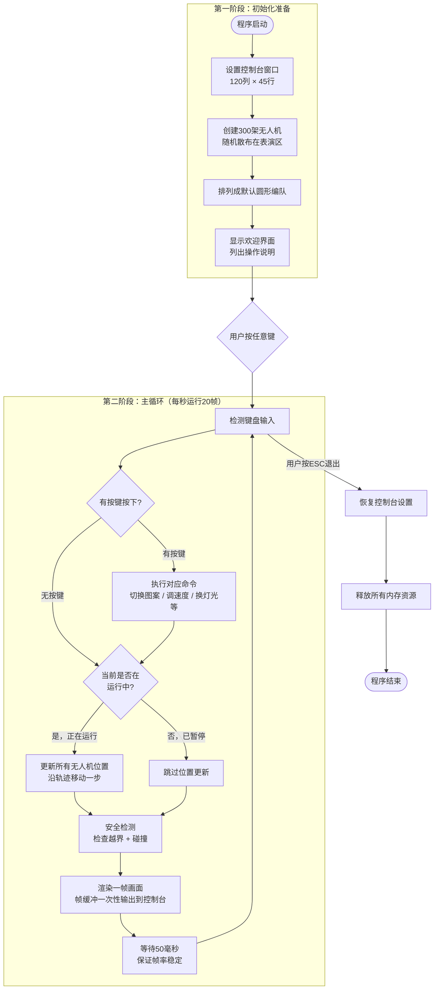
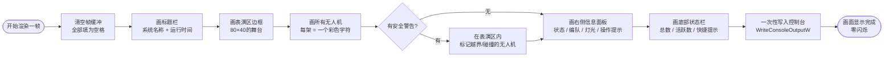
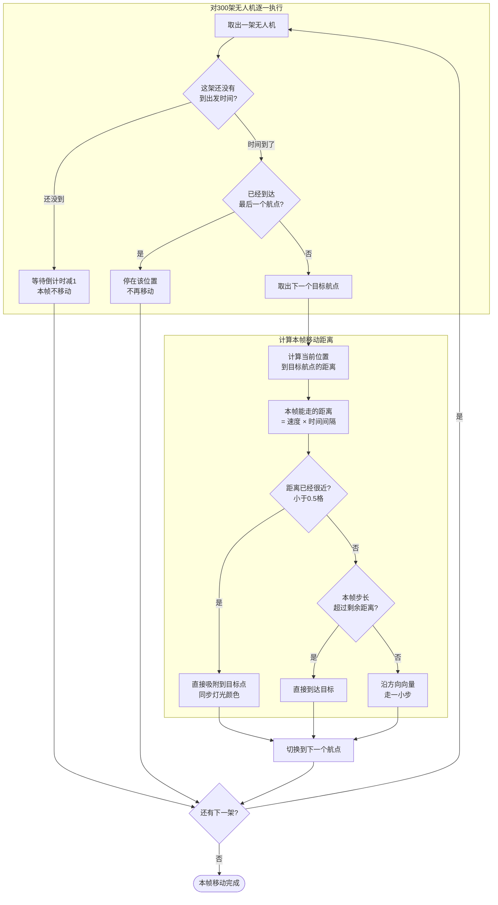
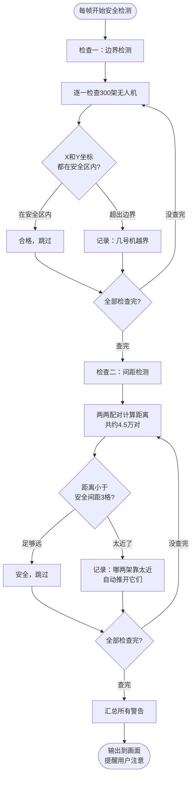
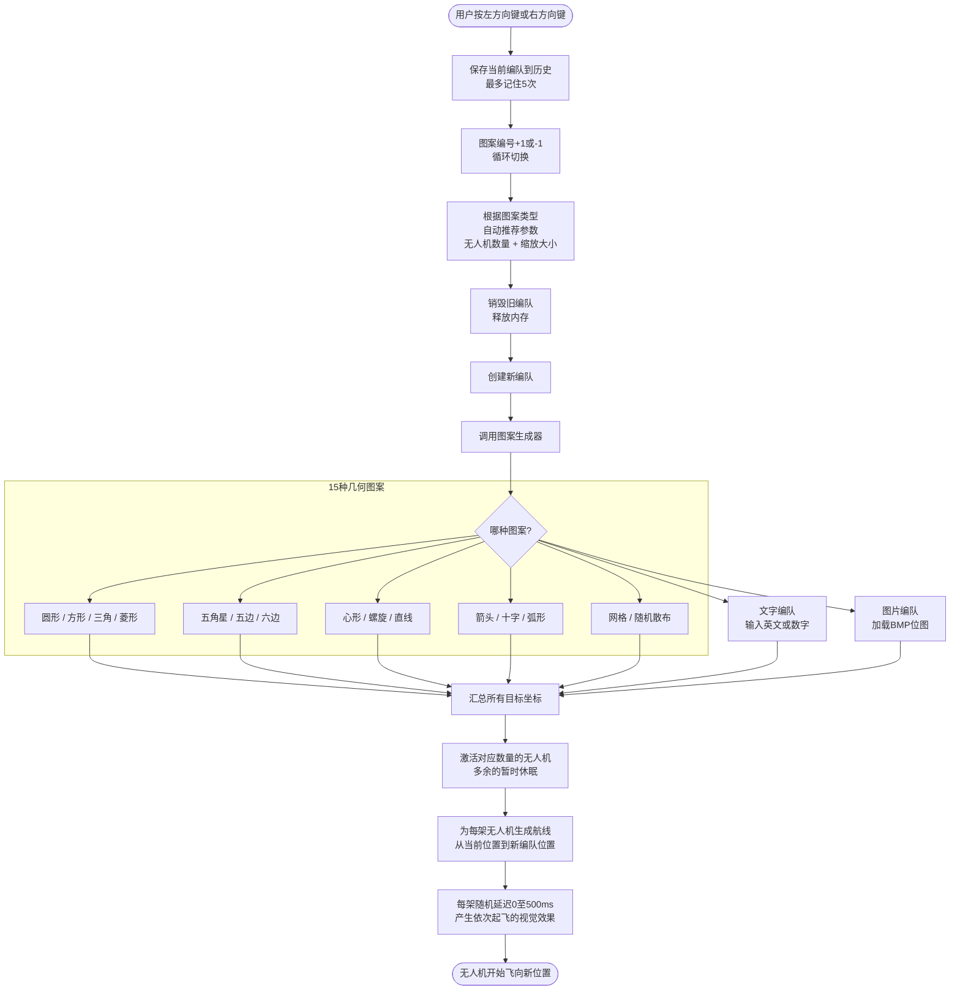
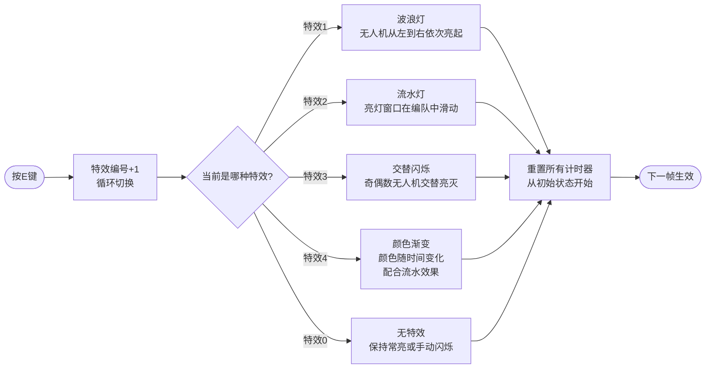
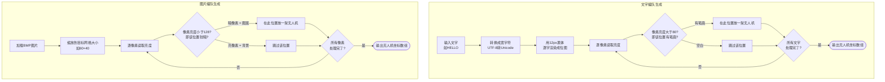
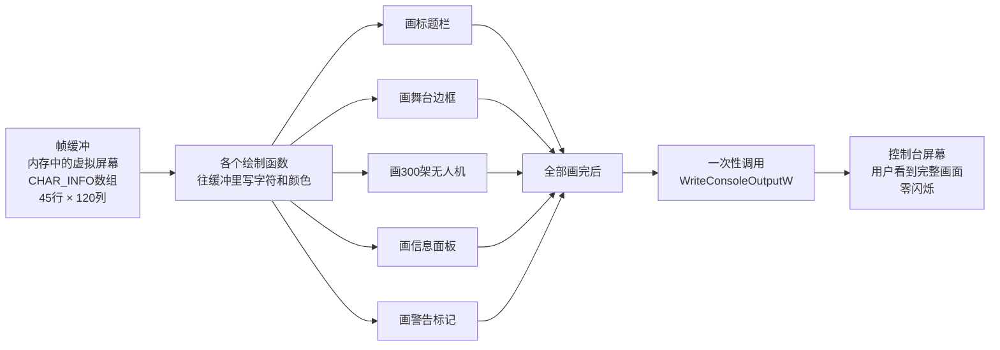
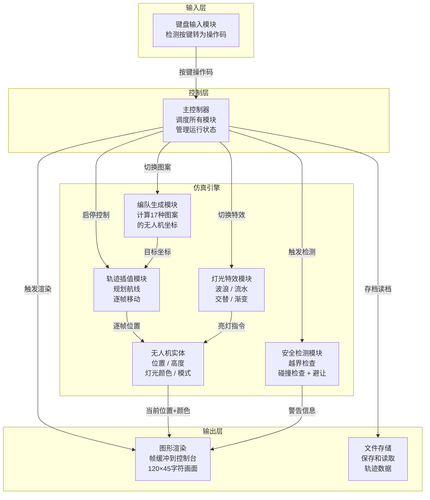

# 无人机编队灯光秀模拟系统 —— 流程图

> **图形说明**：圆角矩形 = 起点/终点 | 矩形 = 处理步骤 | 菱形 = 判断分支 | 平行四边形 = 输入/输出

---

## 1. 程序整体运行流程

---

## 2. 每一帧画面渲染流程

---

## 3. 无人机移动控制

---

## 4. 安全检测流程

---

## 5. 图案切换流程

---

## 6. 灯光特效切换

---

## 7. 文字和图片编队生成

---

## 8. 帧缓冲渲染原理

---

## 9. 系统数据流全景

---

## 附录：图案类型速查表

| 编号 | 图案 | 生成方式 | 编号 | 图案 | 生成方式 |
|------|------|---------|------|------|---------|
| 1 | 圆形 | 等角圆周分布 | 10 | 直线 | 等间距排列 |
| 2 | 正方形 | 四边等距分布 | 11 | 箭头 | 箭身70% + 三角箭头30% |
| 3 | 三角形 | 三边等分 | 12 | 十字 | 竖臂50% + 横臂50% |
| 4 | 菱形 | 四边等分，对角轴 | 13 | 弧形 | 等角圆弧-150度至150度 |
| 5 | 五角星 | 外圈+内圈交替 | 14 | 网格 | 行列均匀分布 |
| 6 | 五边形 | 五边等分 | 15 | 随机 | 均匀随机坐标 |
| 7 | 六边形 | 六边等分 | 16 | 文字 | 5×7点阵字库 |
| 8 | 心形 | 参数方程 | 17 | 图片 | BMP像素采样 |
| 9 | 螺旋 | 阿基米德螺旋 | | | |
