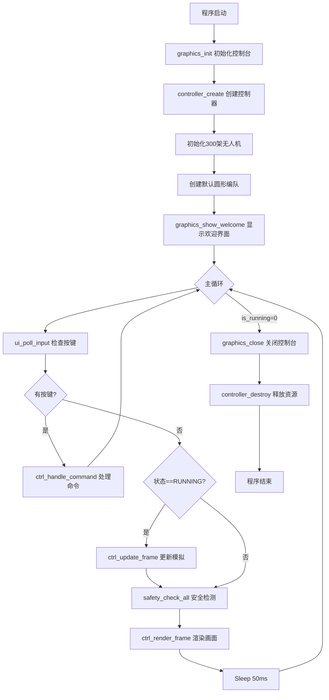
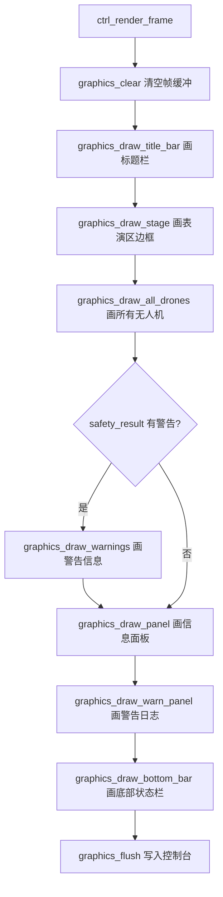
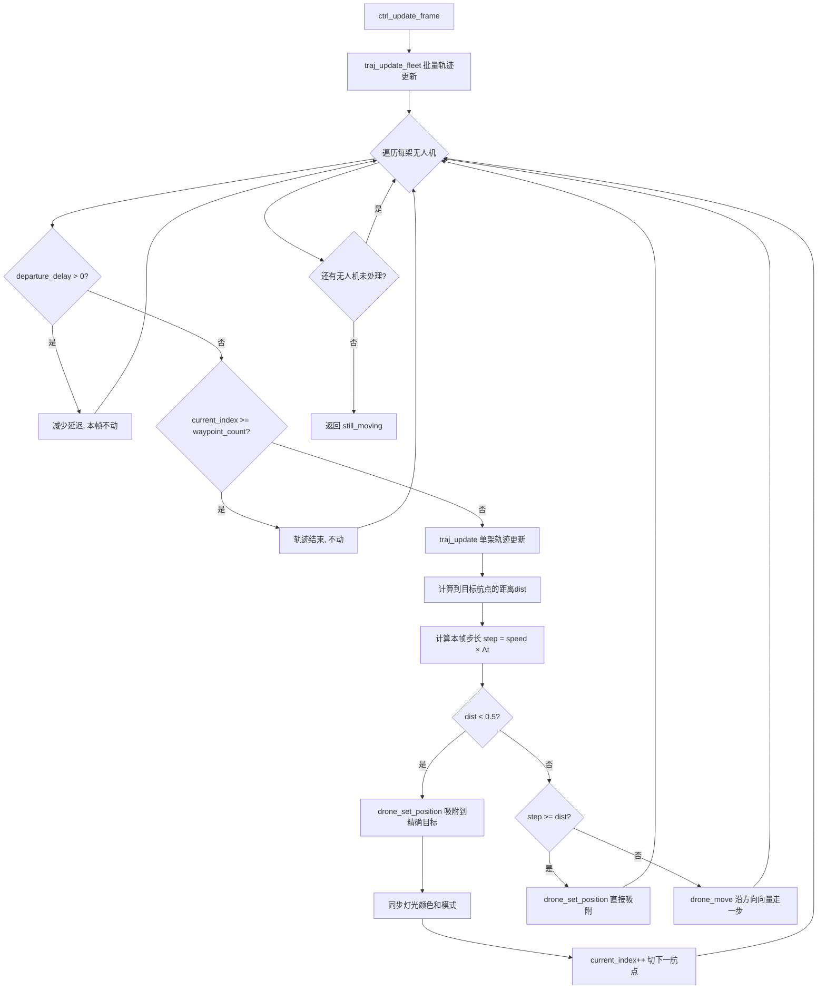
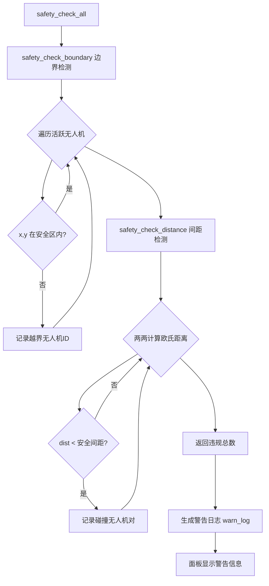
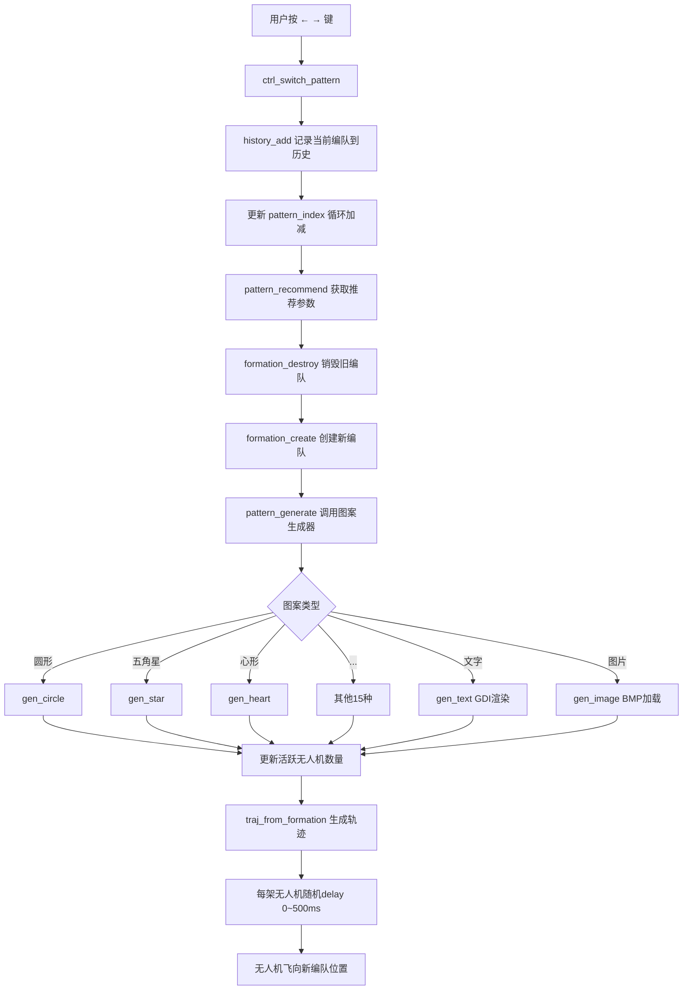
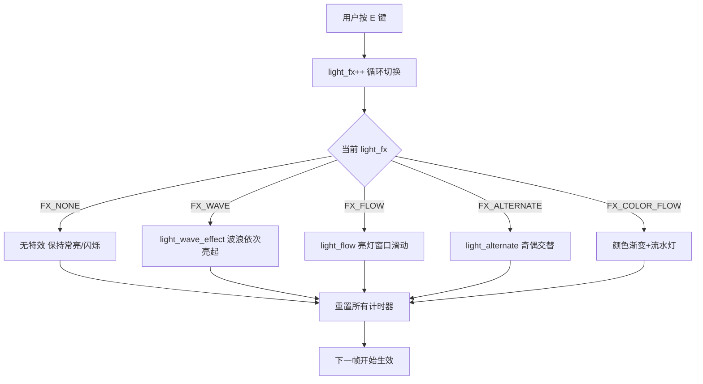
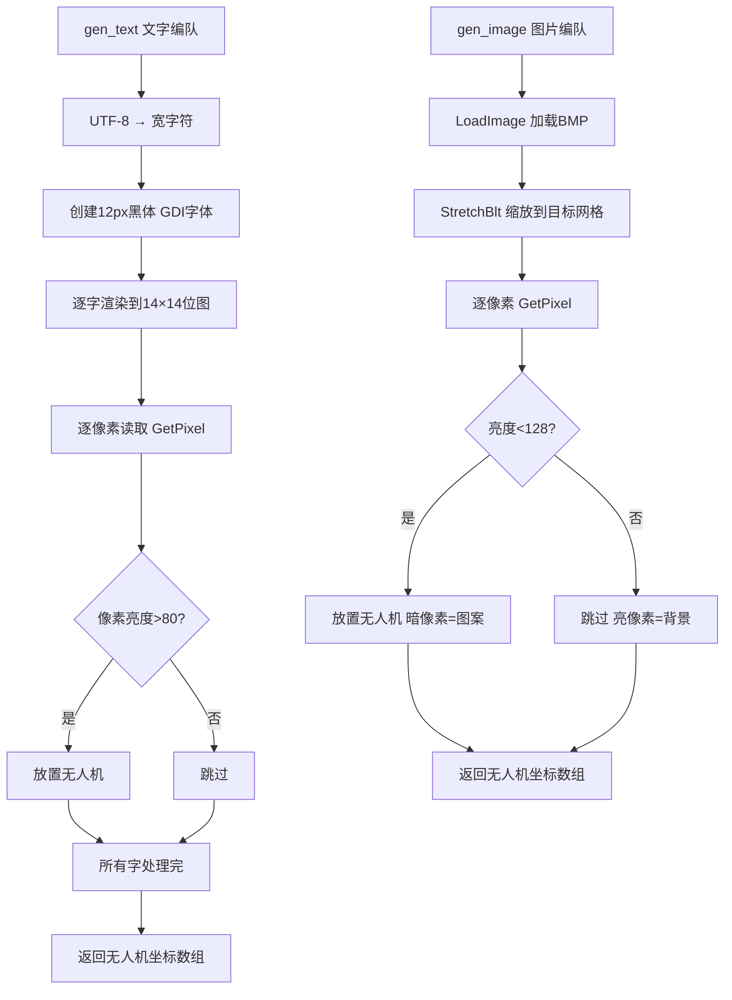
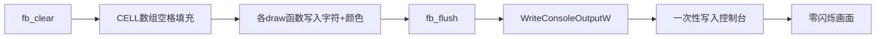
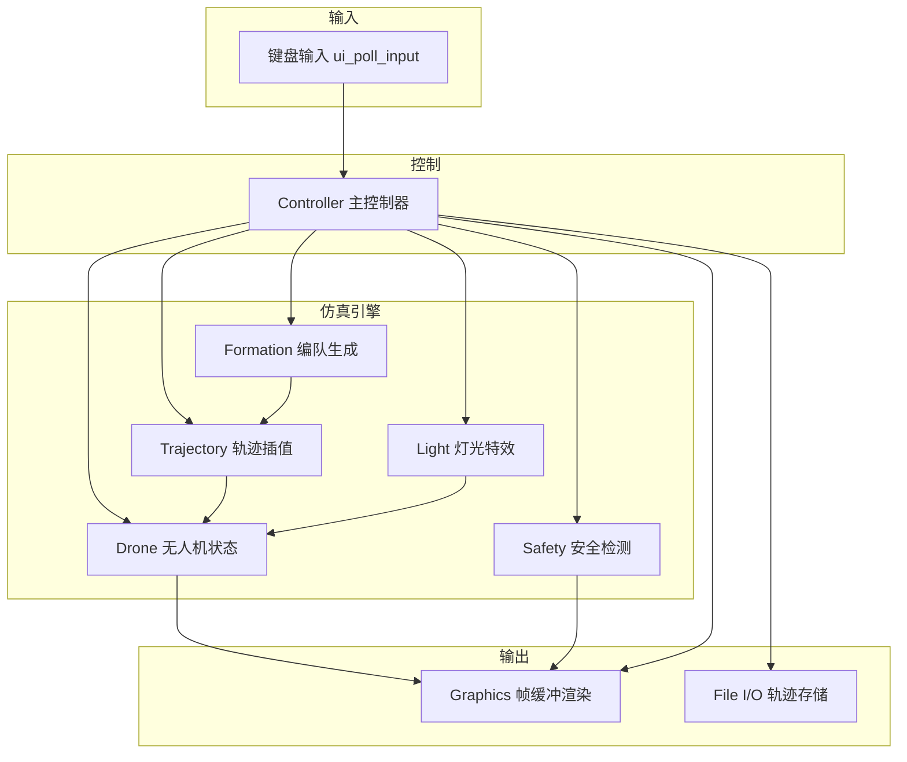

# 无人机编队灯光秀模拟系统 —— 流程图

## 1. 程序总体流程

```mermaid
flowchart TD
    A[程序启动] --> B[graphics_init 初始化控制台]
    B --> C[controller_create 创建控制器]
    C --> D[初始化300架无人机]
    D --> E[创建默认圆形编队]
    E --> F[graphics_show_welcome 显示欢迎界面]
    F --> G{主循环}
    G --> H[ui_poll_input 检查按键]
    H --> I{有按键?}
    I -->|是| J[ctrl_handle_command 处理命令]
    J --> G
    I -->|否| K{状态==RUNNING?}
    K -->|是| L[ctrl_update_frame 更新模拟]
    L --> M[safety_check_all 安全检测]
    M --> N[ctrl_render_frame 渲染画面]
    N --> O[Sleep 50ms]
    O --> G
    K -->|否| M
    G -->|is_running=0| P[graphics_close 关闭控制台]
    P --> Q[controller_destroy 释放资源]
    Q --> R[程序结束]
```

## 2. 主循环渲染流程

```mermaid
flowchart TD
    A[ctrl_render_frame] --> B[graphics_clear 清空帧缓冲]
    B --> C[graphics_draw_title_bar 画标题栏]
    C --> D[graphics_draw_stage 画表演区边框]
    D --> E[graphics_draw_all_drones 画所有无人机]
    E --> F{safety_result 有警告?}
    F -->|是| G[graphics_draw_warnings 画警告信息]
    G --> H[graphics_draw_panel 画信息面板]
    F -->|否| H
    H --> I[graphics_draw_warn_panel 画警告日志]
    I --> J[graphics_draw_bottom_bar 画底部状态栏]
    J --> K[graphics_flush 写入控制台]
```

## 3. 无人机移动控制

```mermaid
flowchart TD
    A[ctrl_update_frame] --> B[traj_update_fleet 批量轨迹更新]
    B --> C{遍历每架无人机}
    C --> D{departure_delay > 0?}
    D -->|是| E[减少延迟, 本帧不动]
    E --> C
    D -->|否| F{current_index >= waypoint_count?}
    F -->|是| G[轨迹结束, 不动]
    G --> C
    F -->|否| H[traj_update 单架轨迹更新]
    H --> I[计算到目标航点的距离dist]
    I --> J[计算本帧步长 step = speed × Δt]
    J --> K{dist < 0.5?}
    K -->|是| L[drone_set_position 吸附到精确目标]
    L --> M[同步灯光颜色和模式]
    M --> N[current_index++ 切下一航点]
    N --> C
    K -->|否| O{step >= dist?}
    O -->|是| P[drone_set_position 直接吸附]
    P --> C
    O -->|否| Q[drone_move 沿方向向量走一步]
    Q --> C
    C --> R{还有无人机未处理?}
    R -->|是| C
    R -->|否| S[返回 still_moving]
```

## 4. 安全检测流程

```mermaid
flowchart TD
    A[safety_check_all] --> B[safety_check_boundary 边界检测]
    B --> C{遍历活跃无人机}
    C --> D{x,y 在安全区内?}
    D -->|是| C
    D -->|否| E[记录越界无人机ID]
    E --> C
    C --> F[safety_check_distance 间距检测]
    F --> G{两两计算欧氏距离}
    G --> H{dist < 安全间距?}
    H -->|是| I[记录碰撞无人机对]
    I --> G
    H -->|否| G
    G --> J[返回违规总数]
    J --> K[生成警告日志 warn_log]
    K --> L[面板显示警告信息]
```

## 5. 图案切换流程

```mermaid
flowchart TD
    A[用户按 ← → 键] --> B[ctrl_switch_pattern]
    B --> C[history_add 记录当前编队到历史]
    C --> D[更新 pattern_index 循环加减]
    D --> E[pattern_recommend 获取推荐参数]
    E --> F[formation_destroy 销毁旧编队]
    F --> G[formation_create 创建新编队]
    G --> H[pattern_generate 调用图案生成器]
    H --> I{图案类型}
    I -->|圆形| J1[gen_circle]
    I -->|五角星| J2[gen_star]
    I -->|心形| J3[gen_heart]
    I -->|...| J4[其他15种]
    I -->|文字| J5[gen_text GDI渲染]
    I -->|图片| J6[gen_image BMP加载]
    J1 --> K[更新活跃无人机数量]
    J2 --> K
    J3 --> K
    J4 --> K
    J5 --> K
    J6 --> K
    K --> L[traj_from_formation 生成轨迹]
    L --> M[每架无人机随机delay 0~500ms]
    M --> N[无人机飞向新编队位置]
```

## 6. 灯光特效切换

```mermaid
flowchart TD
    A[用户按 E 键] --> B[light_fx++ 循环切换]
    B --> C{当前 light_fx}
    C -->|FX_NONE| D[无特效 保持常亮/闪烁]
    C -->|FX_WAVE| E[light_wave_effect 波浪依次亮起]
    C -->|FX_FLOW| F[light_flow 亮灯窗口滑动]
    C -->|FX_ALTERNATE| G[light_alternate 奇偶交替]
    C -->|FX_COLOR_FLOW| H[颜色渐变+流水灯]
    D --> I[重置所有计时器]
    E --> I
    F --> I
    G --> I
    H --> I
    I --> J[下一帧开始生效]
```

## 7. 文字/图片编队生成

```mermaid
flowchart TD
    A[gen_text 文字编队] --> B[UTF-8 → 宽字符]
    B --> C[创建12px黑体 GDI字体]
    C --> D[逐字渲染到14×14位图]
    D --> E[逐像素读取 GetPixel]
    E --> F{像素亮度>80?}
    F -->|是| G[放置无人机]
    F -->|否| H[跳过]
    G --> I[所有字处理完]
    H --> I
    I --> J[返回无人机坐标数组]

    K[gen_image 图片编队] --> L[LoadImage 加载BMP]
    L --> M[StretchBlt 缩放到目标网格]
    M --> N[逐像素 GetPixel]
    N --> O{亮度<128?}
    O -->|是| P[放置无人机 暗像素=图案]
    O -->|否| Q[跳过 亮像素=背景]
    P --> R[返回无人机坐标数组]
    Q --> R
```

## 8. 帧缓冲渲染原理

```mermaid
flowchart LR
    A[fb_clear] --> B[CELL数组空格填充]
    B --> C[各draw函数写入字符+颜色]
    C --> D[fb_flush]
    D --> E[WriteConsoleOutputW]
    E --> F[一次性写入控制台]
    F --> G[零闪烁画面]
```

## 数据流总览

```mermaid
flowchart TD
    subgraph 输入
        UI[键盘输入 ui_poll_input]
    end
    subgraph 控制
        CTRL[Controller 主控制器]
    end
    subgraph 仿真引擎
        DRONE[Drone 无人机状态]
        FORM[Formation 编队生成]
        TRAJ[Trajectory 轨迹插值]
        SAFE[Safety 安全检测]
        LIGHT[Light 灯光特效]
    end
    subgraph 输出
        GFX[Graphics 帧缓冲渲染]
        FILE[File I/O 轨迹存储]
    end
    UI --> CTRL
    CTRL --> DRONE
    CTRL --> FORM
    CTRL --> TRAJ
    CTRL --> SAFE
    CTRL --> LIGHT
    DRONE --> GFX
    FORM --> TRAJ
    TRAJ --> DRONE
    SAFE --> GFX
    LIGHT --> DRONE
    CTRL --> GFX
    CTRL --> FILE
```
